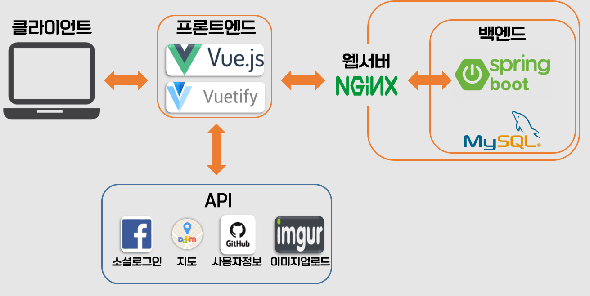

# 웹/모바일 프로젝트 (웹 기술)

## 공통프로젝트 - 반응형 단일 페이지 애플리케이션 구현          (20.01.13 ~ 20.02.21)

### 1. Overview

- 본 프로젝트는 단일 페이지 애플리케이션(Single Page Application)의 개념을 이해하고 반응형 웹(Responsive Web)의 특징을 파악하여 사용자 친화적이고 다양한 디바이스에 최적화 된 웹을 구현하는 것입니다.

- 웹의 기본 기능과 반응형 디자인으로 자신만의 포트폴리오로 발전 시킬 수 있는 블로그 형태의 서비스 토대를 만들고 다양한 API를 적용한 사용자 기능과 관리자(백오피스) 기능을 강화하여 개발자로서 활용성을 높게 가져갈 수 있는 SW 개발 비서 형식의 웹 서비스를 만드는 것입니다.

- 목표
  
  1. 기본 HTML 및 CSS에 대한 이해
  2. JavaScript(ES6)에 대한 이해
  3. 웹 UI/UX에 대한 이해
  4. Database 설계 및 구조 이해
  5. Backend의 구조 이해
  6. Rest API 제작
  7. PWA(Progressive Web Application)에 대한 이해
  8. 웹 서비스 구성 요소에 대한 이해
  
- 서비스 소개

  - 서비스명 : Ssafari(싸파리), 싸피생들만의 활발한 생태계를 지향한다는 의미

  - 본 프로젝트에서 구현한 것은 `지역`, `기수`, `취업 여부` 등에 상관없이 `싸피생`이라면 누구나 참여할 수 있는 활발한 커뮤니티 웹 서비스입니다.

  - `싸피생`임을 인증받기 위해서 새로 회원가입한 사람은 본인의 `싸피 명찰`을 업로드하여 `관리자`의 승인을 받아야 합니다. 관리자는 관리자 대시보드를 통해 싸피 명찰의 진위여부를 확인하고 승인할 수 있습니다.

  - 싸피 커뮤니티 서비스인만큼 `자유게시판`, `취업게시판`, `주변 맛집 리뷰 게시판`, `코드 리뷰 게시판`, `스터디 게시판` 등의 기본 게시판을 갖고 있습니다.  기본 게시판 이외에도 `사용자`는 본인이 형성하고자 하는 커뮤니티에 맞게 `게시판을 생성`할 수 있고, 이 또한 관리자의 승인하에 만들 수 있습니다.

  - 각 게시판은 지역별로 구분되고, 검색 기능을 포함하고 있어 손 쉽게 정보에 다가갈 수 있습니다.

  - 아키텍처

    

### 2. Prerequsites

-  본 코드를 이용하기 위해서 아래와 같은 환경을 구축했는지 먼저 확인해 주시기 바랍니다. 

  - `Node.js` - [Download & Install Node.js](https://nodejs.org/en/download/)이 필요합니다.  또한`npm package` 또는 `yarn package`를 설치했는지 확인해 주세요.
  - `MySQL` - [Download & Install MySQL](https://www.mysql.com/downloads/)이 필요합니다. 저희는 `MySQL`을 DB로 사용합니다.
  - `Java & Spring` - [Download & Install JDK](https://www.oracle.com/technetwork/java/javase/downloads/index.html) 이 필요합니다. 백엔드 프레임워크로서 `Java` 기반의 `Spring`을 사용합니다.
  - `Vue.js` - [Download & Install Vue](https://vuejs.org/v2/guide/installation.html) Component기반의 SPA를 구현하기 위해 저희는 Vue.js를 프론트엔드 개발 도구로 사용합니다.
  - `Nginx` - [Download & Install nginx](https://www.nginx.com/free-trial-request/) Nginx를 웹서버로 사용하여 AWS EC2 환경에서 배포하였습니다.
- `API`
  - `Facebook Login API`: 소셜로그인으로서 페이스북 로그인을 지원합니다.
  - `Kakao map API`: 카카오/다음 지도 API를 활용해서 식당/카페를 주소/상호명 등으로 검색할 수 있고, 선택한 점포를 지도로 표시할 수 있습니다.
  - `Github API`: 사용자가`github` 계정을 등록하면 저희가 설정한 API를 통해 Github 통계 정보를 제공받을 수 있습니다.
  - `Imgur API`: 이미지 업로드 API인 `Imgur API`를 통해 DB에 직접적으로 이미지를 저장하지 않고, 대신 효율적으로 `Imgur URL`을 저장합니다.  

### 3. Setup & build

**Cloning The Gitlab Repository**

저희가 구축한 서비스의 코드를 살펴보기 위해 추천드리는 방법은 `s02p13b101` repository를 살펴보는 것입니다.

```bash
$ git clone https://lab.ssafy.com/webmobile1-sub3/s02p13b101.git
```

**require npm package**

**A5**가 만든 서비스를 제대로 살펴보시려면 아래와 같은 다양한`npm package`들을 필요로 합니다.

```bash
$ npm install
$ npm install -g @vue/cli
$ npm install vue
$ npm install vuetify
$ npm install --save vueperslides
$ npm install --save aos
$ npm install --save vue-codemirror
$ npm install --save vue-echarts
$ npm install --save vue-simplemde
```

- `vuetify`: `vuetify` 기반으로 UI component들을 배치하였습니다.
- `vueperslides`: `Carousel` component를 위한 package입니다.
- `aos`: 화면의 fade 효과를 주기 위한 package입니다. 
- `vue-codemirror`: 텍스트 형태의 코드를 정해진 언어의 코드 형식으로 표시해줍니다.
- `vue-echarts`: 사용자 정보 데이터를 차트로 표현하기 위한 package입니다.
- `vue-simplemde`: 텍스트를 `Markdown` 형태로 사용하기 위한 package입니다.

### 4. Run(local environment)

 #### 프런트엔드

프런트엔드 로컬 환경 구축이 끝났다면 아래와 같은 명령어로 application을 실행시켜 주세요.

```bash
$ npm run serve
```

 프론트엔드를 `Vue.js`로 사용하기 때문에 `8080`포트를 사용합니다. 정상적으로 application이 실행되면 `localhost:8080`으로 접속해 서비스를 살펴볼 수 있습니다.

아래와 같은 화면이 나오면 성공.


#### 백엔드

백엔드 로컬 환경 구축이 끝났다면 통합 java IDE에서 Run 해주세요.
